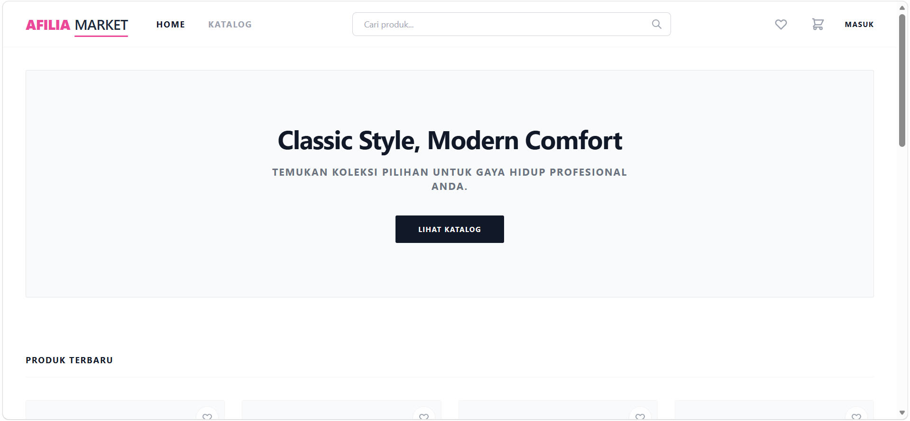
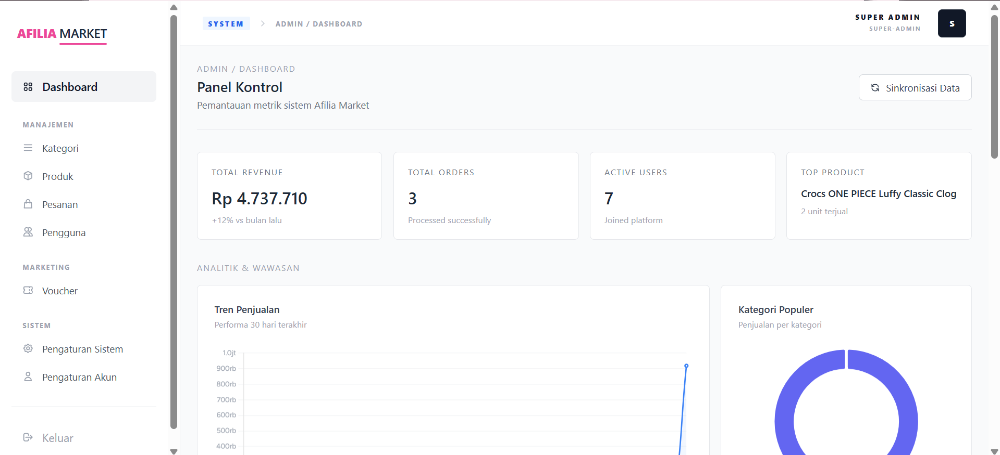

<div align="center">
  # 🛒 Afilia Shop - Enterprise E-Commerce & Marketplace

  **Afilia Shop** adalah platform E-Commerce skala Enterprise (Marketplace) modern yang dibangun menggunakan **Laravel 12**. Sistem ini dirancang untuk mempermudah proses jual beli secara online, memfasilitasi banyak penjual (multi-vendor) di dalam satu platform, serta menyediakan sistem manajemen pesanan, produk, stok, dan pembayaran secara komprehensif. Website ini juga memanfaatkan teknologi **Livewire v3** untuk memberikan pengalaman layaknya SPA (Single Page Application) yang cepat dan responsif.
</div>

<br />

## 📸 Tampilan Aplikasi
| Halaman Utama | Dashboard Admin | Dashboard Vendor |
| :---: | :---: | :---: |
| [] | [] |

---

## 🚀 Fitur Unggulan
* **Sistem Multi-Role:** Pembagian hak akses yang ketat (Super Admin, Admin, Staff, Vendor, dan Customer) menggunakan *Spatie Permission*.
* **Marketplace (Multi-Vendor):** Vendor pihak ketiga dapat mendaftar, membuka toko, mengelola prdouk sendiri, menangani pesanan, dan melakukan *withdrawal* (penarikan dana).
* **Payment Gateway Integration:** Terhubung dengan **Midtrans** untuk memproses berbagai metode pembayaran secara otomatis dan *real-time*.
* **Manajemen Produk Kompleks:** Mendukung kategori bertingkat, variasi harga (SKU), manajemen stok, harga diskon, dan manajemen atribut.
* **Keranjang Belanja & Wishlist:** Sistem Cart yang efisien dilengkapi penyimpanan produk favorit (Wishlist).
* **Multi-Alamat & Ekspedisi:** Pengguna dapat menyimpan banyak alamat untuk keperluan *checkout*.
* **Sistem Voucher & Diskon:** Voucher potongan harga yang dapat diatur berdasarkan nilai tetap atau persentase, dengan kuota klaim.
* **Invoice Digital:** Fitur generate invoice berformat PDF untuk setiap pesanan yang telah dikonfirmasi.

---

## 🛠️ Teknologi yang Digunakan
Project ini dibangun dengan ekosistem teknologi modern sebagai berikut:

* **Backend:** Laravel Framework (^12.0) dengan PHP (^8.2)
* **Database:** MySQL / MariaDB
* **Frontend:** Livewire (^3.6), Alpine.js
* **Styling:** Tailwind CSS
* **Tools:** XAMPP, npm/Node.js, Composer
* **Library Ekstra:** 
  * Midtrans (Payment Gateway)
  * Laravel-DomPDF (Generate PDF)
  * Spatie Laravel Permission (Roles & Permissions)
  * Laravel Breeze (Authentication)

---

## 📂 Struktur Folder
Berikut adalah struktur direktori utama pada project ini (berdasarkan arsitektur Laravel):

```text
/afilia-shop
├── app/               # Logic aplikasi (Models, Traits, Helpers)
│   ├── Http/          # Controller (Midtrans, Invoice)
│   └── Livewire/      # Komponen Livewire (Cart, Checkout, Manager, Dashboard)
├── database/          # File Migrasi & Sistem Seeder (Data Dummy)
├── public/            # File statis (CSS, JS build, upload gambar)
├── resources/         
│   ├── css/ & js/     # Konfigurasi Tailwind & JavaScript
│   └── views/         # File Blade (.blade.php) untk UI aplikasi
├── routes/            # Definisi rute URL (web.php, auth.php)
├── .env.example       # Contoh environment variable
├── composer.json      # Dependencies PHP
└── package.json       # Dependencies Node/NPM
```

---

## � Cara Instalasi & Menjalankan
Ikuti langkah-langkah berikut untuk menjalankan project di lokal (misalnya menggunakan XAMPP):

### 1. Persiapan Environment
Pastikan Anda telah menginstal **XAMPP**, **Composer**, dan **Node.js**. Pastikan versi **PHP 8.2** atau lebih tinggi.

### 2. Clone Repository
Buka terminal dan clone project ini ke dalam folder `htdocs` Anda (XAMPP):

```bash
cd C:\xampp4\htdocs
git clone https://github.com/AlfyeShezan/afilia-shop.git
cd afilia-shop
```

### 3. Install Dependencies
Jalankan perintah berikut untuk menginstal package PHP dan Node.js:
```bash
composer install
npm install
npm run build
```

### 4. Konfigurasi Database & Environment
1. Buat file `.env` dengan meng-kopi `.env.example`:
   ```bash
   cp .env.example .env
   ```
2. Buat database baru di `phpMyAdmin` (misal: `toko_online`).
3. Sesuaikan konfigurasi di dalam file `.env`:
   ```env
   DB_CONNECTION=mysql
   DB_HOST=127.0.0.1
   DB_PORT=3306
   DB_DATABASE=toko_online
   DB_USERNAME=root
   DB_PASSWORD=

   MIDTRANS_SERVER_KEY=kode_api_midtrans_server_anda
   MIDTRANS_CLIENT_KEY=kode_api_midtrans_client_anda
   ```

### 5. Generate Key & Migrasi Data
Jalankan perintah ini untuk membangun tabel database, *roles*, dan akun default (*dummy* data):
```bash
php artisan key:generate
php artisan migrate:fresh --seed
```

### 6. Jalankan Server Lokal
```bash
php artisan serve
```
Buka browser dan akses alamat berikut:
**`http://localhost:8000`**

---

## � Akun Default (Demo)
Berkat *seeder* database, Anda dapat login menggunakan kredensial dummy berikut pada halaman `/login`:

**Administrator Utama:**
* **Username:** `admin@afilia.shop`
* **Password:** `password`

**Staff System:**
* **Username:** `staff@afilia.shop`
* **Password:** `password`

**Customer (Pelanggan Ujicoba):**
* **Username:** `customer@afilia.shop`
* **Password:** `password`

*(Anda juga dapat mendaftar sendiri sebagai pelanggan baru melalui halaman Register).*

---

## 🤝 Kontribusi
Kontribusi selalu terbuka! Jika Anda ingin meningkatkan project ini, silakan:

1. **Fork** repository ini.
2. Buat **branch fitur baru** (`git checkout -b fitur-baru`).
3. **Commit** perubahan Anda (`git commit -m 'Menambahkan fitur keren'`).
4. **Push** ke branch Anda (`git push origin fitur-baru`).
5. Buat **Pull Request**.

---

## � Author
**Alfi Dias Saputra**

* **GitHub:** [https://github.com/AlfyeShezan/](https://github.com/AlfyeShezan/)
* **Email:** alfidias1511@gmail.com

*Managed with ❤️ by [Alfye]*
